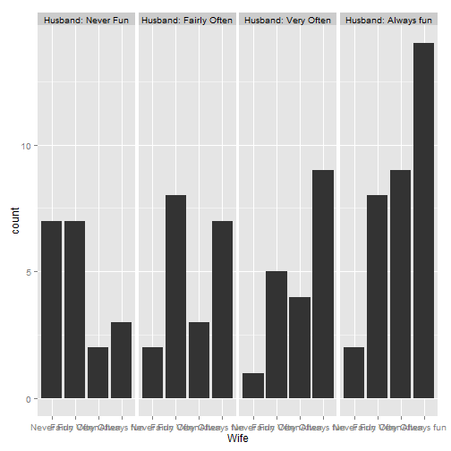
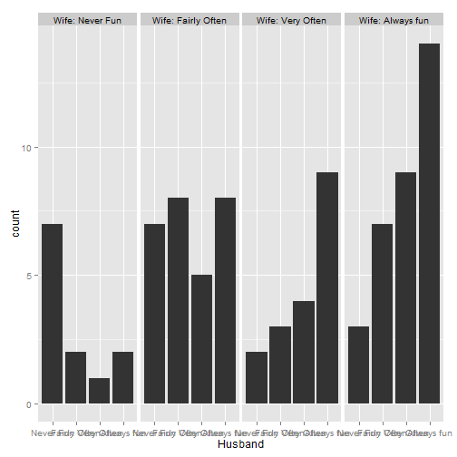

Data Products - Presentation Pitch Assignment using RPresentation
========================================================
author: Hratch Sofoian
date: 24.07.2014

A short explanation
========================================================

This slidfiy summarizes responses to the questionnaire item "Sex is fun for me and my partner: 

- (a) never or occasionally
- (b) fairly often
- (c) very often
- (d) almost always

for 91 married couples from the Tucson metropolitan area.


```r
library(grid); library(vcd); library(ggplot2); data(SexualFun)
sf = as.data.frame(SexualFun)
```

Preview of the Data
========================================================


```r
head(SexualFun)
```

```
              Wife
Husband        Never Fun Fairly Often Very Often Always fun
  Never Fun            7            7          2          3
  Fairly Often         2            8          3          7
  Very Often           1            5          4          9
  Always fun           2            8          9         14
```

Wife's Rating of Sexual Fun
========================================================

 

Husband's Rating of Sexual Fun
========================================================

 
